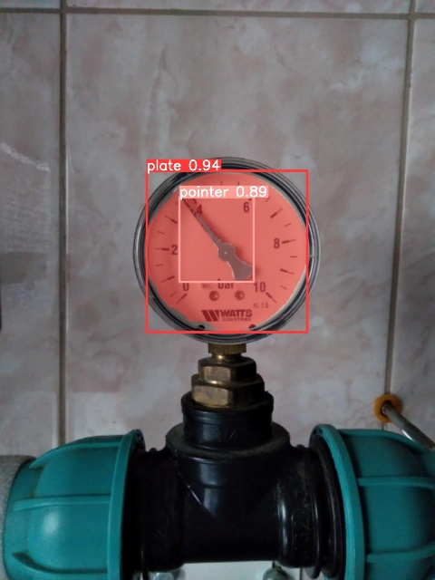
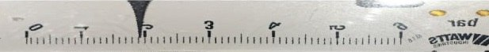

# :collision: Sensorium API
Система удаленного мониторинга показаний датчиков давления.

## :bulb: Introduction

Разработанный сервис предоставляет доступ для удаленного мониторинга показаний датчиков давления. 

Алгоритм распознавания состоит из двух частей:
- детекция плато датчика на изображении;
- распознавания показания с помощью афинных преобразований.

1) Детекция реализована с помощью обученной модели Yolov8s на [датасете](https://universe.roboflow.com/project-3mdqv/metre/dataset/1/images/?split=train&numImages=60), состоящий из 522 изображений датчиков давления в различных условиях.



2) Распознавание показаний реализовано с помощью библиотеки **OpenCV**. Алгоритм работает с помощью преобразований в полярной системе координат



## :paw_prints: Разработка API

1. Для локальной разработки необходимо установить [poetry](https://python-poetry.org/):

```bash
$ sudo apt updatei
$ sudo apt install -y curl
$ curl -sSL https://install.python-poetry.org | python3 -
```

После установки поетри, необходимо его настроить:

```bash
$ poetry config virtualenvs.in-project true
```

Далее необходимо установить зависимости проекта:

```bash
$ poetry install
```

2. Затем необходимо создать директорию в корне проекта с названием *media*

```bash
$ mkdir media
```

3. В папке [data](data) необходимо создать папку с названием *weights* и положить туда [веса](https://drive.google.com/file/d/1o9m9R16qnCM38OrCNnzXYRL0CNK6wAy0/view?usp=sharing) обученной модели.

## :whale: Локальный запуск
Прежде всего необходимо установить [Docker](https://docs.docker.com/engine/install/).

Для сборки контейнеров:

- docker 1 version
```bash
$ docker-compose up --build
```

- docker 2 version
```bash
$ docker compose up --build
```

Для запуска приложения:

- docker 1 version
```bash
$ docker-compose up
```

- docker 2 version
```bash
$ docker compose up
```

Оно будет запущено на [`http://localhost:8000`](http://localhost:8000).

Документация API доступна по следующему адресу: [`http://localhost:8000/api/schema/swagger-ui/`](http://localhost:8000/api/schema/swagger-ui/).

## :whale: Удаление образа

```
$ docker-compose -f docker-compose.yml down
```
